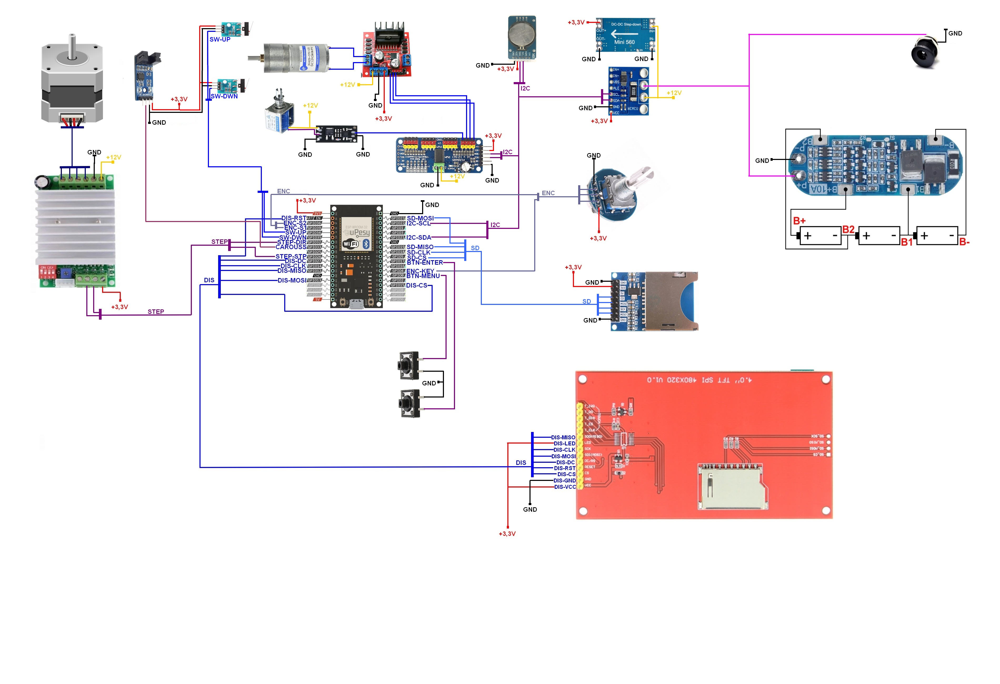

# Electrical Schematic – Tissue Processor

This directory contains the electrical schematics of the **Tissue Processor** device,
showing the interconnection of all electronic components.

The schematics document:
- power distribution and voltage regulation  
- microcontroller connections  
- motor drivers and actuators  
- sensors and limit switches  
- display, control panel, and user inputs  
- communication interfaces (Bluetooth, I²C, SPI)  

---

## 🖼️ Schematic Overview

  

---

The diagram provides an overview of the system architecture and wiring between
individual modules. It is intended as a reference for maintenance, debugging,
and further development.

> **Note:** Component values, pin assignments, and wiring correspond to the hardware
revision used in this project. Hardware changes may require schematic updates.
